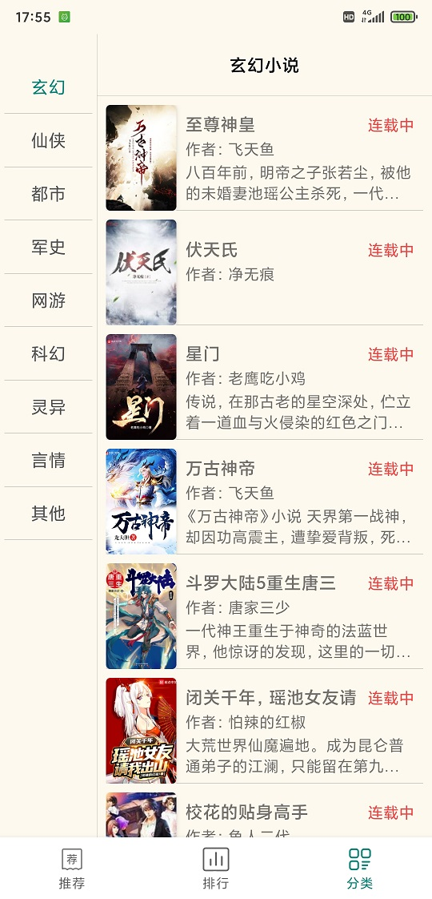
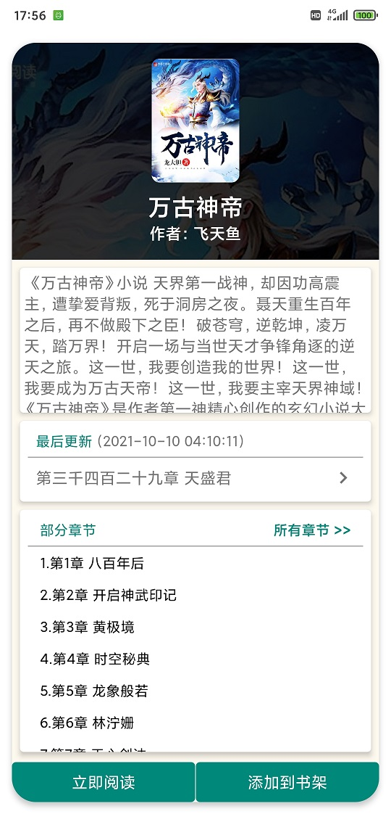

# biqugeApp
小说app，使用某个笔趣阁作为源来看小说，因为对第三方app和手机版网页的广告不满，正好暑假没事做就开发了这款app
由于是以网页解析的形式浏览网站的小说，如果网页有改动的话就会出现章节名称不显示的问题，但不会闪退，闪退问题都处理了

使用Android原生开发，没有嵌套webview，用OkHttp和Jsoup解析网页，然后存储显示

开发日期为2021.8.5

[演示视频https://zhuanlan.zhihu.com/p/628715152](https://zhuanlan.zhihu.com/p/628715152)

